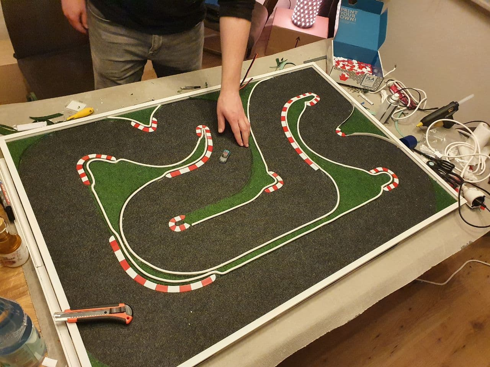

# RFID based DIY lap counter for ESP32

Small cars need smaller transponders.

This project is made to count laps and run races with the e.g. 1:76 scale rc cars from aliexpress. As RC522 or PN532 modules are highly available and cheap enough to fool around with they are a good choice. Tiny [transponders](https://www.amazon.de/gp/product/B01CJYUSG0) are available to stick onto the cars all of whats missing is a small customization regarding the RFID modules antenna and a little software to make it happen.

What you'll need:

- Small self adhesive 13,56 MHz RFID tags to stick onto your cars.
- About 4 to 5 (readonly) RFID modules for 13.56 Mhz (other frequencies may follow)
- A strip of addressable LED's (e.g. WS2812b, this project is using 13 of them)
- A buzzer / speaker
- A button

You will now need to choose a module type to read the transponder. This project is using a RC522 for now because they were available right away. As the tracks width is about 15cm and the chips antenna is only about ~4cm, multiple chips will need to be mounted next to each other. The best setup regarding the position is still an ongoing process as there are still experiments taking place to get most reliable readings. An .stl file to print a bridge covering the chips, the LED's and some more stuff will get published so you can build one yourself.

## Installation

Just flash (the to be published) binary file onto your esp32 and connect the following way (incomplete, will be completed as soon as done)

| GPIO Pin | Thing to connect        |
| -------- | ----------------------- |
| 17       | Buzzer                  |
| 16       | Data Line for the LED's |
| 5        | Button                  |

## ⚙️ Features

- Start & end races
- Automatically adds drivers to a list if detected by the RFID reader
- (WIP) View results, including lap count, times per lap and final position
- (WIP) OTA
